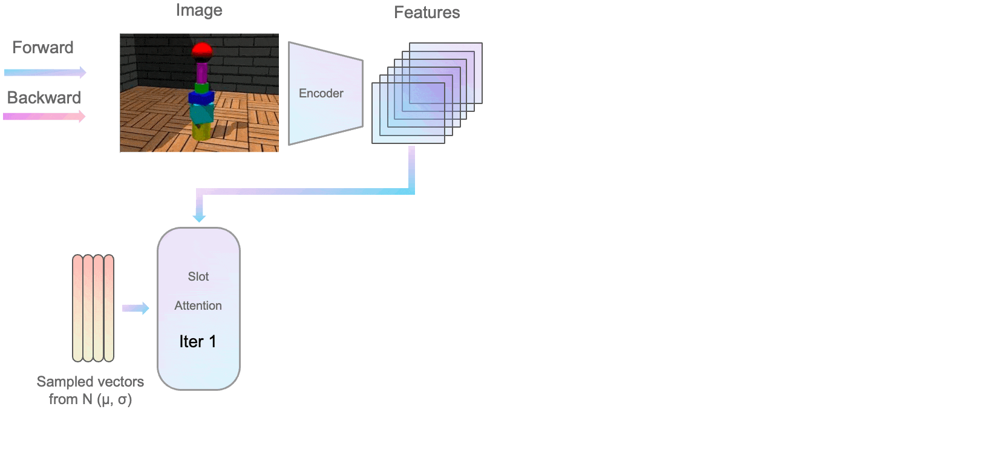

# BO-QSA

<p align="left">
    <a href='https://arxiv.org/abs/2210.08990'>
      
    </a>
    <a href='https://arxiv.org/pdf/2210.08990.pdf'>
      
    </a>
    <a href='https://bo-qsa.github.io'>
      
    </a>
</p>

This repository contains the official implementation of the ICLR 2023 paper:

[Improving Object-centric Learning With Query Optimization](http://arxiv.org/abs/2210.08990)

[Baoxiong Jia](https://buzz-beater.github.io/)\*, [YuLiu](https://yuliu-ly.github.io)\*, [Siyuan Huang](https://siyuanhuang.com/)
<br>
<p align="center">
     </img>
</p> 

## Environment Setup
We provide all environment configurations in ``requirements.txt``. To install all packages, you can create a conda environment and install the packages as follows: 
```bash
conda create -n BO-QSA python=3.8
conda activate BO-QSA
conda install pytorch==1.10.1 torchvision==0.11.2 torchaudio==0.10.1 cudatoolkit=11.3 -c pytorch -c conda-forge
pip install -r requirements.txt
```
In our experiments, we used NVIDIA CUDA 11.3 on Ubuntu 20.04. Similar CUDA version should also be acceptable with corresponding version control for ``torch`` and ``torchvision``.

## Dataset
### 1. ShapeStacks, ObjectsRoom, CLEVRTex, Flowers
Download ShapeStacks, ObjectsRoom, CLEVRTex and Flowers datasets with
```bash
chmod +x scripts/downloads_data.sh
./downloads_data.sh
```
For ObjectsRoom dataset, you need to run ``objectsroom_process.py`` to save the tfrecords dataset as a png format.
Remember to change the ``DATA_ROOT`` in ``downloads_data.sh`` and ``objectsroom_process.py`` to your own paths.
### 2. PTR, Birds, Dogs, Cars
Download PTR dataset following instructions from http://ptr.csail.mit.edu. Download CUB-Birds, Stanford Dogs, and Cars datasets from [here](https://drive.google.com/drive/folders/1zEzsKV2hOlwaNRzrEXc9oGdpTBrrVIVk), provided by authors from [DRC](https://github.com/yuPeiyu98/DRC). We use the ```birds.zip```, ```cars.tar``` and ```dogs.zip``` and then uncompress them.

### 4. YCB, ScanNet, COCO
YCB, ScanNet and COCO datasets are available from [here](https://www.dropbox.com/sh/u1p1d6hysjxqauy/AACgEh0K5ANipuIeDnmaC5mQa?dl=0), provided by authors from [UnsupObjSeg](https://github.com/vLAR-group/UnsupObjSeg).

### 5. Data preparation
Please organize the data following [here](./data/README.md) before experiments.

## Training

To train the model from scratch we provide the following model files:
 - ``train_trans_dec.py``: transformer-based model
 - ``train_mixture_dec.py``: mixture-based model
 - ``train_base_sa.py``: original slot-attention
We provide training scripts under ``scripts/train``. Please use the following command and change ``.sh`` file to the model you want to experiment with. Take the transformer-based decoder experiment on Birds as an exmaple, you can run the following:
```bash
$ cd scripts
$ cd train
$ chmod +x trans_dec_birds.sh
$ ./trans_dec_birds.sh
```
Remember to change the paths in ``path.json`` to your own paths.
## Reloading checkpoints & Evaluation

To reload checkpoints and only run inference, we provide the following model files:
 - ``test_trans_dec.py``: transformer-based model
 - ``test_mixture_dec.py``: mixture-based model
 - ``test_base_sa.py``: original slot-attention

Similarly, we provide testing scripts under ```scripts/test```. We provide transformer-based model for real-world datasets (Birds, Dogs, Cars, Flowers, YCB, ScanNet, COCO) 
and mixture-based model for synthetic datasets(ShapeStacks, ObjectsRoom, ClevrTex, PTR). We provide all checkpoints [here](https://drive.google.com/drive/folders/10LmK9JPWsSOcezqd6eLjuzn38VdwkBUf?usp=sharing). Please use the following command and change ``.sh`` file to the model you want to experiment with:
```bash
$ cd scripts
$ cd test
$ chmod +x trans_dec_birds.sh
$ ./trans_dec_birds.sh
```

## Citation
If you find our paper and/or code helpful, please consider citing:
```
@inproceedings{jia2023improving,
  title={Improving Object-centric Learning with Query Optimization},
  author={Jia, Baoxiong and Liu, Yu and Huang, Siyuan},
  booktitle={The Eleventh International Conference on Learning Representations},
  year={2023}
}
```

## Acknowledgement
This code heavily used resources from [SLATE](https://github.com/singhgautam/slate), [SlotAttention](https://github.com/untitled-ai/slot_attention), [GENESISv2](https://github.com/applied-ai-lab/genesis), [DRC](https://github.com/yuPeiyu98/DRC.git), [Multi-Object Datasets](https://github.com/deepmind/multi_object_datasets), [shapestacks](https://github.com/ogroth/shapestacks). We thank the authors for open-sourcing their awesome projects.
